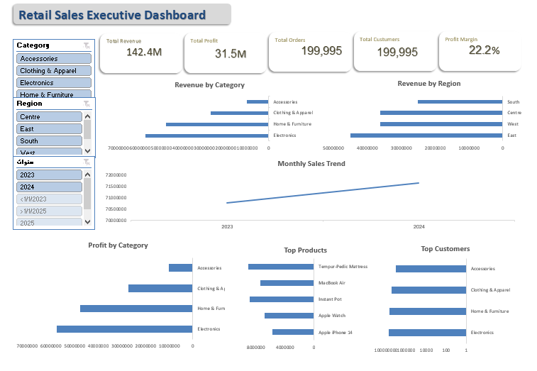

# Retail Sales Analytics Dashboard

An interactive Excel dashboard designed to analyze retail sales performance and support business decision-making through KPI tracking, Pivot Tables, Pivot Charts, and interactive slicers.

---

# Project Overview

This project analyzes retail sales data to provide an executive-level dashboard that helps monitor business performance across products, customers, regions, and time.

The dashboard enables users to explore sales trends, evaluate profitability, identify top-performing products and customers, and filter results dynamically using slicers.

---

# Business Objectives

- Monitor overall business performance.
- Track revenue and profit.
- Analyze sales across product categories and regions.
- Identify top-performing products and customers.
- Explore monthly sales trends.
- Support data-driven business decisions.

---

# Data Quality Checks

Before building the dashboard, the dataset was validated by performing:

- Row and column count verification
- Duplicate record check
- Missing value inspection
- Date range validation
- Negative revenue validation
- Negative profit validation
- Zero quantity check
- Invalid unit price check

---

# Dashboard Features

## Executive KPIs

- Total Revenue
- Total Profit
- Total Orders
- Total Customers
- Profit Margin

## Interactive Analysis

- Revenue by Category
- Revenue by Region
- Monthly Sales Trend
- Profit by Category
- Top 5 Products
- Top 5 Customers

## Interactive Filters

- Category
- Region
- Year

---

# Tools & Skills

- Microsoft Excel
- Pivot Tables
- Pivot Charts
- Slicers
- Data Cleaning
- Data Validation
- KPI Dashboard Design
- Business Analysis

---

# Dashboard Preview




# Project Structure

```
Retail-Sales-Analytics/
│
├── Retail_Sales_Analytics_Dashboard.xlsx
├── dashboard.png
└── README.md
```

---

# Key Insights

- Revenue performance can be analyzed by product category and region.
- Monthly trends help identify seasonal sales patterns.
- Top-performing products and customers are highlighted.
- Interactive filters allow dynamic business exploration.

---

# Author

**Taghreed Mohammed**

Computer Science Graduate | Data Analytics | Business Intelligence | AI